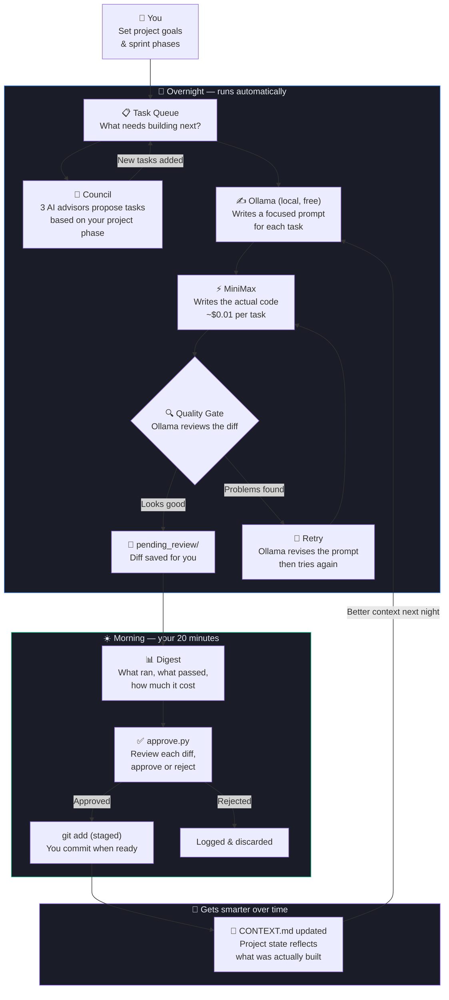

# AI Orchestrator

**Your projects build themselves while you sleep. You review in the morning.**

An autonomous multi-project development system that runs AI coding tasks overnight — using local Ollama models for free orchestration and MiniMax for code generation — then surfaces diffs for your approval each morning. You stay in control of every line that gets merged.

---

## What problem does this solve?

You have six projects. You have twenty hours a week. The math doesn't work.

The orchestrator runs your projects continuously — generating code, running tests, keeping context up to date — while you're asleep or working on something else. Every morning you spend 20 minutes reviewing what was built, approving what looks good, and rejecting what doesn't. Nothing gets committed without your sign-off.

It is not an autonomous agent that deploys to production. It is an overnight workforce that queues its output for human review.

---

## How it works (non-technical)



---

## Projects

| Project | What it is | AI split |
|---|---|---|
| **Language Travel App** | Japanese/Spanish learning via 3D immersive scenes | 95% — pure generation, auto-tested |
| **Meridian** | Social platform mobile port (React Native + Expo) | 80% — screens, API wiring, types |
| **Ironhold RTS** | Medieval RTS + FPS hybrid (Unity) | 85% — C# systems, editor scripts |
| **Gamma Exposure Tool** | SPX 0DTE options analysis + backtesting | 90% — overnight backtest loops |
| **NinjaTrader Algo** | ATR + Fibonacci trading strategies (NinjaScript) | 75% — parameter sweeps |
| **Tax / Cloud Tools** | Azure AVD + PowerShell for tax practice | 85% — scripts and docs |

---

## Three-layer architecture

```
┌─────────────────────────────────────────────────────────┐
│  LAYER 1 — ORCHESTRATION (free, local)                  │
│                                                         │
│  Ollama qwen3-coder:30b  prompt writing, quality gate   │
│  Ollama qwen3:14b        digest prose, context updates  │
│  Python daemon           scheduling, routing, tracking  │
└───────────────────────┬─────────────────────────────────┘
                        │
┌───────────────────────▼─────────────────────────────────┐
│  LAYER 2 — EXECUTION (~$65/mo cap)                      │
│                                                         │
│  MiniMax M3  all code generation (direct API calls)     │
│              council task generation (~$0.01/run)       │
└───────────────────────┬─────────────────────────────────┘
                        │
┌───────────────────────▼─────────────────────────────────┐
│  LAYER 3 — YOU                                          │
│                                                         │
│  Morning review    20 min: read digest, approve diffs   │
│  Afternoon check   15 min: unblock stalled tasks        │
│  Evening confirm   10 min: approve, confirm queue set   │
└─────────────────────────────────────────────────────────┘
```

---

## Cost

| Component | Purpose | Cost |
|---|---|---|
| Ollama (local) | Orchestration, prompts, quality gate | **Free** |
| MiniMax M3 PAYG | All code generation | **$65/mo hard cap** |
| Your time | Review, approve, creative direction | **~45 min/day** |

The hard cap is enforced in code — the orchestrator halts at $65/month regardless of queue size. Set a matching spend limit in your MiniMax dashboard as a second layer.

---

## Getting started

### Prerequisites

```bash
# 1. Ollama installed and running with required models
ollama pull qwen3-coder:30b
ollama pull qwen3:14b

# 2. Python 3.10+
python3 --version

# 3. APScheduler and requests
pip3 install apscheduler requests
```

### Setup

```bash
# Clone the repo
git clone https://github.com/thejdog2000/AI_Orchestrator.git
cd AI_Orchestrator

# Set your MiniMax API key
export MINIMAX_API_KEY="your_key_here"
# Add to ~/.zshrc to persist across sessions

# Start the git watcher (handles auto-commits from a separate process)
python3 git_watcher.py &

# Run the orchestrator
python3 orchestrator_main.py
```

On startup you'll see:
```
Orchestrator starting — enabled: ['lang']
Monthly spend: $0.00 / $65
Ollama healthy — models loaded: {'qwen3-coder:30b', 'qwen3:14b'}
Queue: {'queued': 3, 'total_cost_usd': 0.0}
Dashboard → /path/to/dashboard/index.html
```

### Your morning workflow

```bash
# See what ran overnight
python3 approve.py

# Review and approve a specific diff
python3 approve.py lang_001_1234567890

# Open a diff in your terminal pager
python3 approve.py --open lang_001_1234567890

# Reject a diff
python3 approve.py --reject lang_001_1234567890

# Commit approved changes (you batch and commit yourself)
git -C ~/Documents/claude/projects/language-travel-app commit -m "feat: izakaya scene"
```

---

## Key files

```
AI_Orchestrator/
├── orchestrator_main.py   Entry point — scheduler, process lock, startup
├── config.py              Single source of truth for all config (edit this)
├── executor.py            MiniMax API calls, quality gate, feedback loop
├── task_queue.py          SQLite task storage with full schema
├── task_generator.py      Council-based task generation via MiniMax
├── lang_pipeline.py       Dedicated language scene pipeline (7-night schedule)
├── digests.py             Morning/afternoon/evening reports
├── spend.py               Spend tracking with atomic writes
├── approve.py             CLI for reviewing and approving diffs
├── dashboard_generator.py Static Kanban dashboard (open in browser)
├── git_watcher.py         Auto-commit daemon (run separately)
├── config.py              ← Edit this to change models, paths, sprint goals
├── ORCHESTRATOR_CONTEXT.md  Feed to any AI session to restore full context
├── TODO.md                Remaining work, prioritised
└── COMPLETED.md           Full history of everything built and fixed
```

---

## Safety design

Every code change follows this path before touching your repos:

1. **Path traversal protection** — AI-generated file paths are validated before writing. No file can be written outside its project repo.
2. **Quality gate** — every diff is reviewed by Ollama before queuing. Failures flag for human review rather than auto-approving.
3. **No auto-commit** — diffs are staged but never committed. You commit.
4. **No auto-deploy** — nothing touches client infrastructure, production, or any external system.
5. **Hard spend cap** — halts at $65/month in code. Set a matching limit in MiniMax dashboard.
6. **Approval required flag** — auth, security, user data schema, and client deliverables are flagged and skipped until you manually approve them.

---

## How it gets smarter

After each completed task, Ollama reads the git diff and updates the project's `CONTEXT.md`:

```
Task runs → code written → Ollama summarises what changed
→ CONTEXT.md updated → next task prompt has better context
→ MiniMax gets progressively more accurate instructions each night
```

Without this loop, every run would start from a static snapshot. With it, the system builds a living understanding of each project over time.

---

## Expanding to more projects

The orchestrator starts with `lang` only. Before enabling others:

1. Validate the full pipeline on one scene (lang)
2. Confirm spend tracking is accurate
3. Review the morning digest — does it reflect reality?
4. Add the next project to `ENABLED_PROJECTS` in `config.py`

Multiple projects can run simultaneously — they have separate repos and per-project locks prevent overlap within the same codebase.

---

## Related docs

- [ORCHESTRATOR_CONTEXT.md](ORCHESTRATOR_CONTEXT.md) — full architecture, budget, sprint schedule, design decisions. Feed this to any AI session.
- [TODO.md](TODO.md) — remaining work, prioritised by severity
- [COMPLETED.md](COMPLETED.md) — full history of bugs fixed and features built
